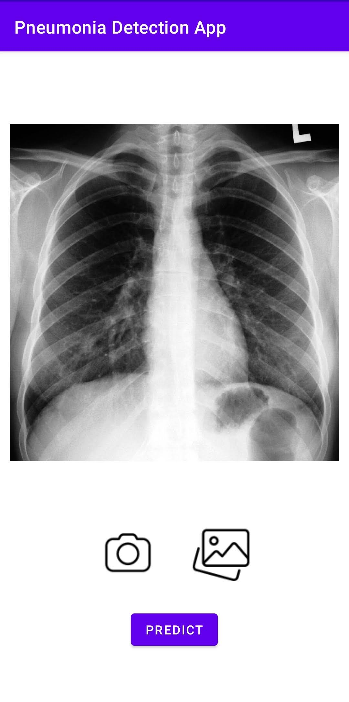

# Pneumonia Detection Android App

(predition.jpg)

This Android app utilizes state-of-the-art deep learning technology to detect pneumonia from X-ray images. With an impressive accuracy rate of 96% and an AUC of 98%, this app provides a reliable and efficient tool for assisting medical professionals in diagnosing pneumonia.

## Features

- **High Accuracy**: The underlying deep learning model has been trained on a large dataset and fine-tuned to achieve an accuracy rate of 96%, ensuring reliable detection results.

- **Advanced AI**: Powered by TensorFlow Lite, the app employs cutting-edge artificial intelligence techniques for efficient and accurate pneumonia detection.

- **Intuitive Interface**: The user-friendly interface makes it easy for medical practitioners to upload X-ray images and quickly receive results.

- **Real-time Analysis**: Results are generated in real-time, allowing for swift decision-making and diagnosis.

## Installation

1. Clone this repository to your local machine using:

https://github.com/akborhossain/PneumoniaDetectionApp.git

2. Open the project in Android Studio.

3. Build and run the app on your Android device or emulator.

## Usage

1. Launch the app on your Android device.

2. Choose or capture an X-ray image using the app's interface.

3. Submit the image for analysis.

4. In a matter of seconds, the app will provide a prediction regarding the presence of pneumonia.

## Model Information

- **Model Accuracy**: 96%
- **AUC (Area Under the Curve)**: 98%

The underlying deep learning model has been trained on a diverse dataset of X-ray images and fine-tuned to achieve exceptional accuracy and AUC values.

## Credits

This app was developed by [Md. Akbar Hossain] and is based on a deep learning model created using TensorFlow. The model training data was sourced from [Kaggle], and the app design was inspired by [Design Inspiration Source].

## Disclaimer

Please note that while this app offers valuable assistance in diagnosing pneumonia, it should not be used as a definitive diagnostic tool. Always consult with a qualified medical professional for accurate medical advice and diagnosis.

---

For any inquiries or contributions, please contact [smakbor33@gmail.com].

**Licensed under [License Name].**

 

